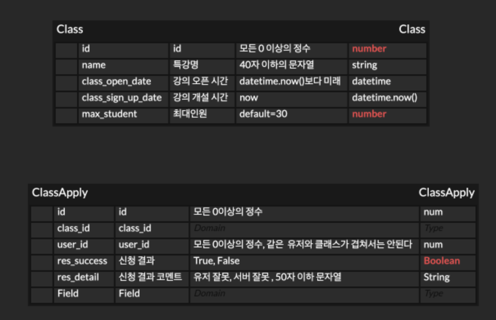

# Apply Class Module

## ERD



## Think About...

      ### 특강에 대한 조건1:  한 유저는 하나의 클래스를 1번만 신청할 수 있다.
      ### 특강에 대한 조건2: transaction이 중요하고 30명이 안찼는지 확실히 확인이 된 이후에 신청할 수 있다.
      ### 특강에 대한 조건3: 성공했으면, is_success결과를 True로 반환하고
      ### 특강에 대한 조건4: 유저의 이유로 실패하면 is_success의 결과를 ㅠ로 반환하고 그 그 detail도 적음
      ### 특강에 대한 조건5: 그냥 트랜젝션 실패면 rollBackTransaction
      

## Installation

```bash
$ npm install
```

## Running the app

```bash
# development
$ npm run start

# watch mode
$ npm run start:dev

# production mode
$ npm run start:prod
```

## Test

```bash
# unit tests
$ npm run test

# e2e tests
$ npm run test:e2e

# test coverage
$ npm run test:cov
```

## Support

Nest is an MIT-licensed open source project. It can grow thanks to the sponsors and support by the amazing backers. If you'd like to join them, please [read more here](https://docs.nestjs.com/support).

## Stay in touch

- Author - [Kamil Myśliwiec](https://kamilmysliwiec.com)
- Website - [https://nestjs.com](https://nestjs.com/)
- Twitter - [@nestframework](https://twitter.com/nestframework)

## License

Nest is [MIT licensed](LICENSE).
